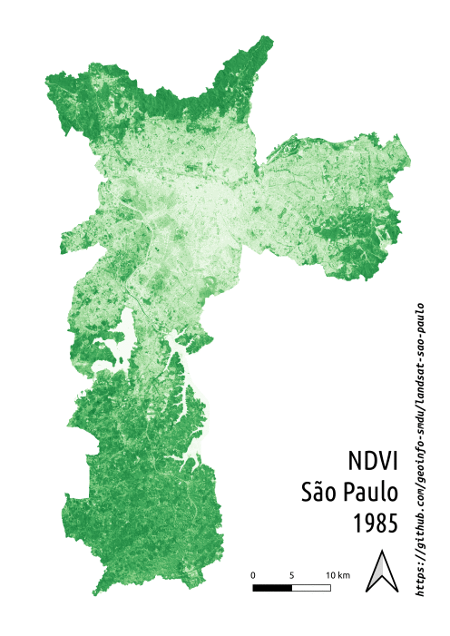

# Imagens Landsat da cidade de São Paulo

Repositório para compilação e processamento inicial das imagens Landsat

## Motivação

As imagens Landsat podem servir para diversos usos e aplicação. Desde uma análide de uso do solo, vegetação até mesmo poluição do ar.

Recentemente para as discuções da revisão do PDE, temos especial interesse para fomentar as discuções sobre o espreiamento urbano.

## Objetivo

O objetivo principal deste reposiório é compilar, pré-processar e publicar imagens do Landsat da cidade de São Paulo, facilitando assim o acesso dos especialistas às imagens.

Como todos os demais repositórios de GeoInfo/SMUL, também temos como objetivo, compartilhar o processo, técnica e método para se chegar aos resultados e com isso estimular a transparência e disseminar os conhecimentos em geoprocessamentos, estimulando assim a cidadania e a autonomia em relação ao uso de dados públicos.

## Materiais e métodos

Foram utilizadas a série de imagens do Landsat desde 1985, do ano todo, a cada 5 anos, ou seja foram obtidas imagens de 1985, 1990, 1995, 2000, 2005, 2010, 2015 e 2020. Com o ajuda da biblioteca [PyLandsat](https://github.com/yannforget/pylandsat), para cada um desses anos estabelecidos, foram carregadas as imagens que continham no máximo 50% de cobertura de nuvens e que intersectassem os limites do município de São Paulo. 

Depois de carregadas as imagens, os pixels cobertos por nuvem foram suprimidos, elas foram recortadas pelo limite do município e combinadas novamente para formar uma imagem completa a cada um dos anos. A escolha foi definido pelo pixel válido da imagem mais recente.

Os processamentos realizados estão disponíveis em formato `Jupyter Notebook` escritos em linguagem de programação `Python`

## Resultados

Sendo assim o resultado está publicado na pasta `resultados` desse repositório separadas por bandas, levando em consideração as bandas disponíveis para cada conjunto de dados de cada ano e o respectivo sensor da aquisição da imagem.

O NDVI (Normalized Difference Vegetation Index), por se tratar de um índice de vegetação versátil e amplamente validado foi calculado, segundo a [metodologia descrita pela USGS](https://www.usgs.gov/core-science-systems/nli/landsat/landsat-normalized-difference-vegetation-index?qt-science_support_page_related_con=0#qt-science_support_page_related_con) e assim como os demais resultados está publicado na mesma pasta ano a ano.

## Como colaborar

Compartilhe, divulgue, corrija, cite, nos conte o que achou ou o que poderíamos melhorar, enfim, este é um repositório público e pertence a cada um que possa utilizá-lo ou se beneficiar com os resultados levantados por ele. 

## Referências 

https://www.earthdatascience.org/courses/use-data-open-source-python/multispectral-remote-sensing/

https://opensourceoptions.com/blog/unsupervised-land-cover-classification-with-python/

https://geohackweek.github.io/raster/04-workingwithrasters/

https://livebook.manning.com/book/geoprocessing-with-python/chapter-12/1

